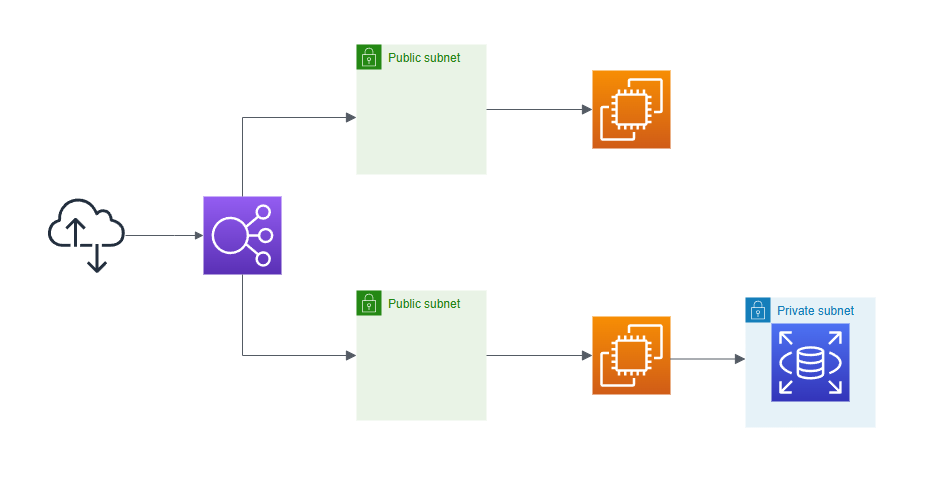

# AWS Infrastructure as Code (IaC) Project with Terraform

This project demonstrates how to design and deploy a highly available and scalable architecture on AWS using **Terraform**. The architecture includes a Virtual Private Cloud (VPC), Subnets, Security Groups, an EC2 instance, an RDS database, and an Elastic Load Balancer (ELB). 

## **Project Overview**
The project is designed to:
- Deploy infrastructure components using Terraform.
- Automate provisioning and configuration of AWS resources.
- Ensure high availability and scalability using best practices.
- Highlight skills in cloud infrastructure automation.

---

## **Table of Contents**
1. [Features](#features)
2. [Architecture Diagram](#architecture-diagram)
3. [Technologies Used](#technologies-used)
4. [Completed Tasks](#completed-tasks)
5. [Remaining Tasks](#remaining-tasks)
6. [Setup Instructions](#setup-instructions)
7. [Usage](#usage)
8. [Future Enhancements](#future-enhancements)

---

## **Features**
- Automated VPC creation with subnets for network isolation.
- EC2 instance deployment in a public subnet.
- RDS database instance in a private subnet.
- Elastic Load Balancer for high availability.
- Security Groups to control inbound and outbound traffic.
- Infrastructure provisioning using Terraform.

---

## **Architecture Diagram**



---

## **Technologies Used**
- **Terraform**: Infrastructure as Code (IaC) tool for resource management.
- **AWS Services**:
  - VPC, Subnets, Security Groups
  - EC2, RDS
  - Elastic Load Balancer (ELB)

---

## **Completed Tasks**
1. **Provider Configuration**: Set up Terraform to use AWS as the provider.
2. **VPC Creation**: Create a VPC for network isolation.
3. **Subnets**: Configure public and private subnets.
4. **Security Groups**: Define rules for inbound and outbound traffic for EC2 and RDS.
5. **EC2 Instance**: Deploy an instance in the public subnet.
6. **RDS**: Provision an RDS instance in a private subnet.
7. **ELB**: Set up an Elastic Load Balancer for distributing traffic.

---

## **Remaining Tasks**
1. **Autoscaling Group**:
   - Automatically scale EC2 instances based on demand.
2. **Monitoring and Logging**:
   - Enable AWS CloudWatch for metrics and logs.
3. **CI/CD Integration**:
   - Set up a CI/CD pipeline for automated deployments.
4. **Private Subnet and NAT Gateway (Optional)**:
   - Host RDS in a private subnet with internet access via a NAT gateway.


---

## **Setup Instructions**

### **Prerequisites**
1. **AWS Account**: Ensure you have an AWS account.
2. **Terraform**: Install Terraform on your machine.
   - [Terraform Installation Guide](https://developer.hashicorp.com/terraform/downloads)
3. **AWS CLI**: Install and configure AWS CLI for your account.
   - [AWS CLI Installation Guide](https://docs.aws.amazon.com/cli/latest/userguide/install-cliv2.html)
4. **IAM User**: Create an IAM user with sufficient permissions for managing resources (e.g., VPC, EC2, RDS).

### **Environment Variables**
Configure AWS credentials using `aws configure` or export them as environment variables:
```bash
export AWS_ACCESS_KEY_ID="your-access-key-id"
export AWS_SECRET_ACCESS_KEY="your-secret-access-key"
```

---

### **Terraform Setup**
1. Clone this repository:
   ```bash
   git clone https://github.com/your-username/aws-iac-terraform.git
   cd aws-iac-terraform
   ```

2. Create a `terraform.tfvars` file with your configuration:
   ```hcl
   region = "us-east-1"
   vpc_cidr = "10.0.0.0/16"
   public_subnet_cidrs = ["10.0.1.0/24", "10.0.2.0/24"]
   private_subnet_cidrs = ["10.0.3.0/24"]
   ec2_instance_type = "t2.micro"
   db_instance_type = "db.t3.micro"
   db_username = "admin"
   db_password = "your-password"
   ```

3. Initialize Terraform:
   ```bash
   terraform init
   ```

4. Plan the infrastructure:
   ```bash
   terraform plan
   ```

5. Apply the configuration:
   ```bash
   terraform apply
   ```

6. Destroy the resources (when no longer needed):
   ```bash
   terraform destroy
   ```

---

## **Usage**
- After applying the Terraform configuration:
  - The EC2 instance will host the application.
  - The RDS database will be available in the private subnet.
  - The Elastic Load Balancer will distribute traffic to the EC2 instances.

---

## **Future Enhancements**
1. **Add Autoscaling**: Integrate an Autoscaling Group with the Load Balancer.
2. **Application Deployment**: Deploy a sample application (e.g., a simple Node.js or Python app).
3. **Monitoring and Logging**: Use CloudWatch for performance monitoring and centralized logging.
4. **CI/CD Pipeline**: Automate deployment using tools like GitHub Actions or Jenkins.

---

## **License**
This project is licensed under the MIT License.